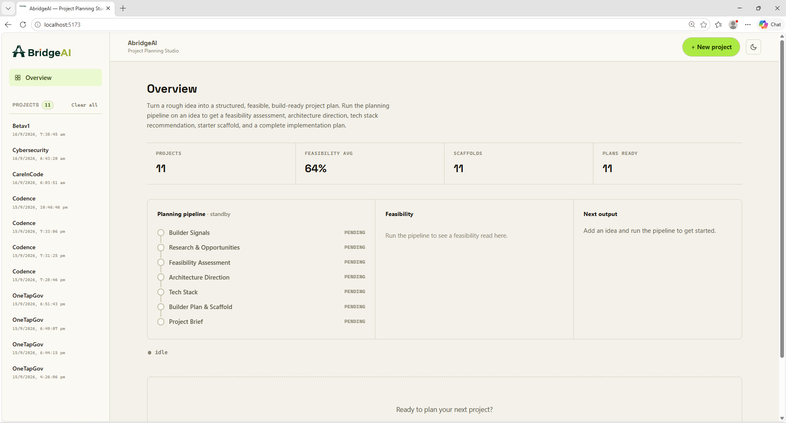
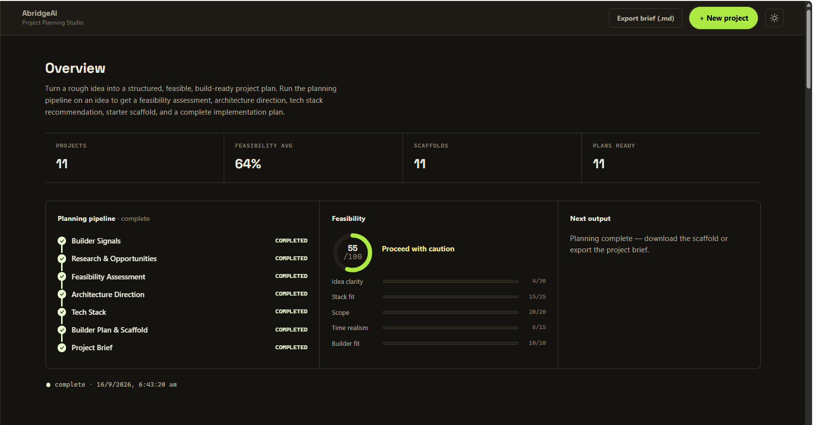
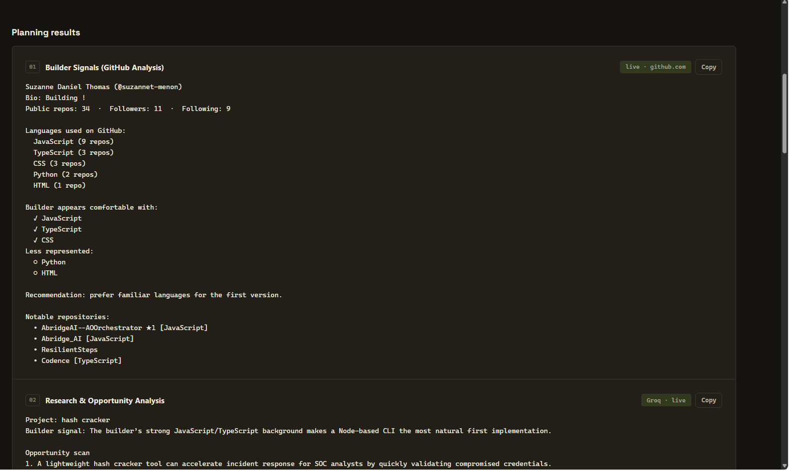
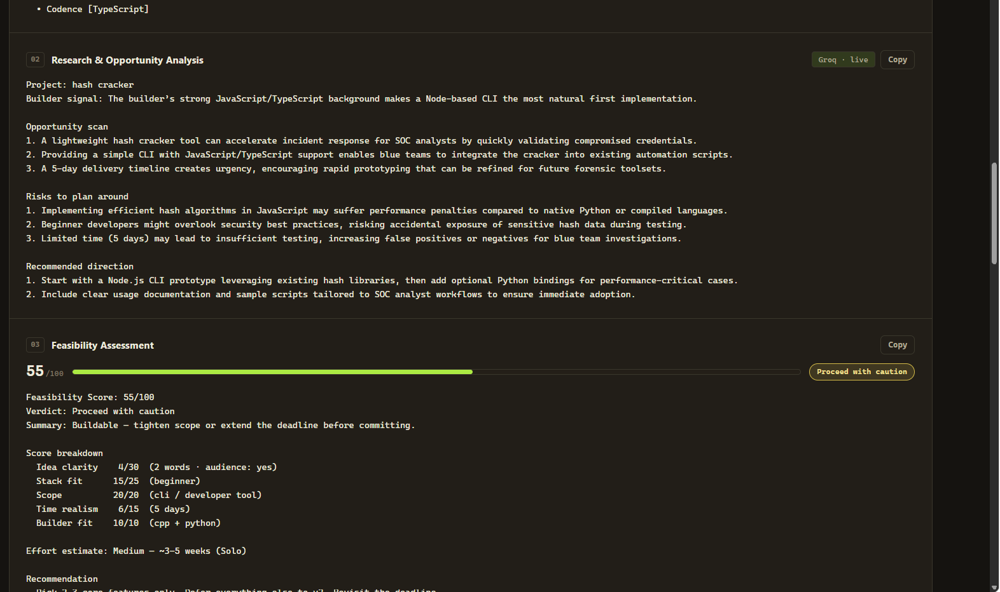
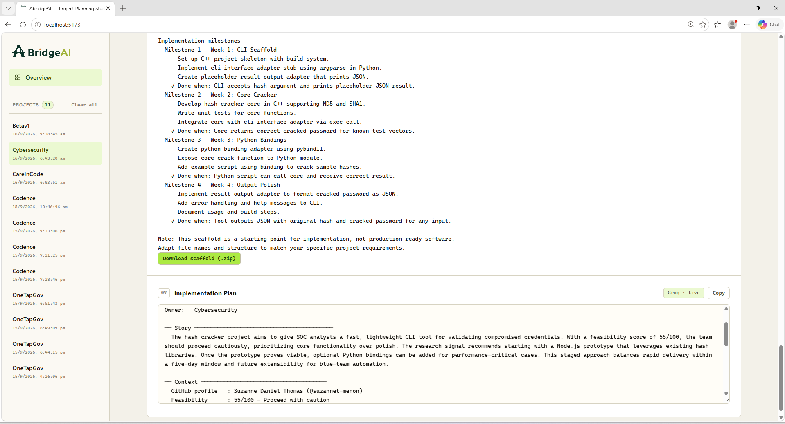
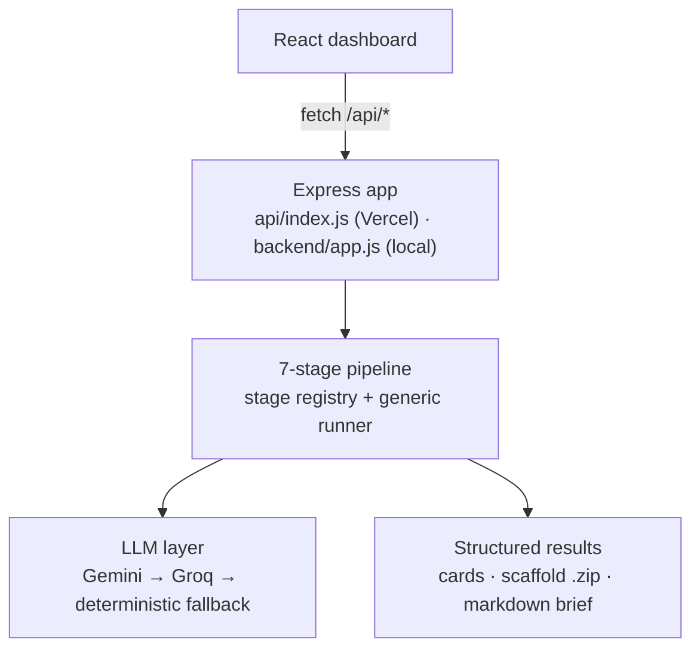

# AbridgeAI

> **From "I have an idea" to "I know exactly what to build."**

AbridgeAI is a standalone AI-powered project planning and feasibility studio that turns rough ideas into structured, build-ready project plans. A Node.js/Express **backend** runs the deterministic planning pipeline (all stage logic), and a React **frontend** dashboard renders the results.

---

## Screenshots

| Overview — light theme | Planning run — dark theme |
|:---:|:---:|
|  |  |
| Dashboard with metrics, project history, and the live pipeline timeline. | A completed planning run with the 7-stage pipeline and feasibility score. |

| Builder profile — dark theme | Research stage — dark theme |
|:---:|:---:|
|  |  |
| Builder profile built from public GitHub language signals. | Opportunity, risk, and direction scan for the idea as written. |

| Starter scaffold — light theme |
|:---:|
|  |
| Generated starter project with file tree, README and PLAN.md — downloadable as a .zip. |

## What is AbridgeAI?

Developers often start with an idea without knowing:

- whether it is actually feasible to build
- how much to build for an MVP
- what technology stack fits their skills and timeline
- how to structure the implementation
- what to build first

AbridgeAI answers all of these questions by running a deterministic planning pipeline on your project inputs.

---

## The Workflow

```
Rough Project Idea
        ↓
Builder Profile (GitHub Signals)
        ↓
Research & Opportunity Analysis
        ↓
Feasibility Assessment
        ↓
Architecture Direction
        ↓
Tech Stack Recommendation
        ↓
Builder Plan & Starter Scaffold
        ↓
Complete Project Brief (exportable .md)
```

---

## Features

- **7-stage planning pipeline** — orchestrated by a backend stage registry; reproducible: identical inputs produce byte-identical outputs
- **Backend API** — Express server runs all pipeline logic (`GET /api/meta`, `POST /api/plan`, `POST /api/export`); the frontend consumes it
- **Stage metadata endpoint** — stage names, order, and hints come from `GET /api/meta`, so the UI timeline never drifts from the backend
- **Feasibility scoring** — a /100 score across five weighted axes (idea clarity, stack fit, scope, time realism, builder fit) with a GO / Proceed with caution / Rethink verdict
- **Builder profile** — personalizes recommendations based on public GitHub language signals
- **Custom stack support** — enter any combination (e.g. `FastAPI + React + PostgreSQL`, or `cpp + python`); it's parsed into per-component layers, a matching starter base is chosen, and the scaffold README lists the exact toolchain (e.g. a C++/CMake note) each planned component needs
- **Deadline-aware milestone plans** — plans are sized to your window: deadlines of ≤ 14 days produce Day-based milestones (Day 1 / Day 3 / Day 5…) and an effort estimate framed around that deadline, instead of always assuming weeks
- **Provider-resilient LLM stages** — each LLM stage shows a badge for where its content came from: `Gemini · live`, `Groq · live`, `LLM · cached`, or `fallback`
- **Architecture blueprint** — module breakdown and data-flow pattern
- **Tech stack recommendation** — matched to your comfort level and project type
- **Starter scaffold** — downloadable as a `.zip` with a project-specific `README.md` (idea, why, architecture diagram, stack rationale, dependencies, quick start) and a `PLAN.md` (feasibility summary and implementation milestones)
- **Markdown export** — full project brief downloadable as `.md`
- **LLM-Enhanced Research** — research, architecture, builder, and brief stages are boosted with idea-specific content from Gemini (`GEMINI_API_KEY`), backed up by Groq (`GROQ_API_KEY`) with automatic fallback, cached results, and live provider badges; the app always works even with no keys set.
- **Project history** — saved to localStorage, restorable, deletable
- **Draft autosave** — form persists across reloads
- **Light & dark themes** — respects system preference, stored across sessions
- **Accessible** — keyboard navigable, ARIA labels, reduced-motion support

---

## Architecture

Two layers — **backend** holds all planning logic, **frontend** is a thin React client that calls the API.



```
AbridgeAI/
├── backend/                      # ALL planning logic lives here
│   ├── server.js                 # entry: createApp().listen(3001)
│   ├── app.js                    # Express app factory (API + static) — shared with local server & Vercel
│   ├── src/
│   │   ├── pipeline/
│   │   │   ├── stages.js         # Single source of truth for the 7 stages
│   │   │   ├── context.js        # Typed pipeline context { input, results, errors }
│   │   │   └── runPipeline.js    # Generic loop over the stage registry
│   │   ├── agents/               # 7 stage functions (run(ctx) → structured outputs)
│   │   │   ├── githubAgent.js
│   │   │   ├── researchAgent.js  # Gemini-first → Groq → deterministic fallback
│   │   │   ├── feasibilityAgent.js
│   │   │   ├── architectureAgent.js
│   │   │   ├── techStackAgent.js
│   │   │   ├── builderAgent.js
│   │   │   └── briefAgent.js     # thin wrapper over brief/model + render
│   │   ├── brief/
│   │   │   ├── model.js          # Canonical brief model (single source)
│   │   │   └── render.js         # renderText() + renderMarkdown()
│   │   ├── domain/               # STACKS, PROJECT_TYPES, TEAM_SIZES, deadlines, custom-stack parsing
│   │   │   ├── stacks.js
│   │   │   ├── types.js
│   │   │   ├── deadline.js
│   │   │   └── techs.js          # customStackTokenizer + component → language map
│   │   ├── prompts/prompts.js    # LLM instruction prompts (stack-as-constraint, deadline-sizing)
│   │   ├── scaffold/             # Starter generators + file tree
│   │   ├── services/
│   │   │   ├── github.js         # GitHub API fetch + sample fallback
│   │   │   ├── llm.js            # LLM orchestrator: Gemini → Groq → deterministic
│   │   │   ├── gemini.js         # Gemini client (OpenAI-compatible), cached per idea-hash
│   │   │   └── groq.js           # Groq client (OpenAI-compatible), cached per idea-hash
│   │   ├── utils/hash.js         # Deterministic hash + seeded pick
│   │   └── export/markdown.js    # Markdown brief builder (legacy-safe)
│   └── package.json              # express (only new dependency)
│
├── src/                          # Frontend (React + Vite)
│   ├── api/client.js             # Fetch wrappers → /api/meta, /api/plan, /api/export
│   ├── components/               # React UI (Header, Pipeline, Cards, Form, …)
│   ├── utils/
│   │   ├── storage.js            # localStorage: history, draft, theme
│   │   ├── export.js             # downloadFile helper
│   │   └── zip.js                # fflate ZIP for the scaffold download
│   ├── App.jsx                   # State + calls backend + view routing
│   ├── main.jsx
│   └── index.css
│
├── api/index.js                  # Vercel serverless entrypoint → createApp()
├── public/data/                  # sample-github-analysis.json (read by backend)
├── vite.config.js                # dev proxy: /api → localhost:3001
├── .env                          # optional: GEMINI_API_KEY / GROQ_API_KEY (see .env.example)
└── package.json
```

### API endpoints

| Method | Path             | Purpose                                                    |
|--------|------------------|------------------------------------------------------------|
| GET    | `/api/health`    | Health check                                              |
| GET    | `/api/meta`      | Stage/domain metadata — drives the timeline + form dropdowns |
| POST   | `/api/plan`      | Run the full 7-stage pipeline → `{ results, errors }`     |
| POST   | `/api/export`    | Render a saved record → `{ filename, markdown }`          |

---

## Running Locally

You need two things running: the **backend** (logic) and the **frontend** (dev server).

```bash
# 1. Install dependencies (root + backend)
npm install
cd backend && npm install && cd ..

# 2. Start the backend API (port 3001)
npm run server

# 3. In a second terminal, start the frontend dev server
npm run dev
# open http://localhost:5173  (Vite proxies /api → localhost:3001)

# Production: build the frontend, backend serves it on one port
npm run start
# open http://localhost:3001
```

> Tip: `npm run start` builds the frontend and launches the backend that serves
> both the API and the built app on `http://localhost:3001`.

---

## Deploying to Vercel

The repo is structured to deploy on Vercel out of the box:

- **Frontend** — Vercel runs `npm run build` (Vite) and serves `dist/`.
- **Backend** — `api/index.js` exports the same Express app (`backend/app.js`)
  as a serverless function. Every `/api/*` request is rewritten to it, and all
  other routes fall back to the SPA's `index.html` (`vercel.json`).
- **No long-lived process needed** — the pipeline runs inside the function
  (max duration is set to 60s in `vercel.json` for the 4 LLM calls).

### Setting environment variables

Set these in **Vercel → Project → Settings → Environment Variables** (never
commit `.env` — it's gitignored):

| Variable           | Required? | Example                          |
|--------------------|-----------|----------------------------------|
| `GEMINI_API_KEY`   | optional  | `AIza…` (from aistudio.google.com) |
| `GEMINI_MODEL`     | optional  | `gemini-3.6-flash`               |
| `GROQ_API_KEY`     | optional  | `gsk_…` (from console.groq.com)  |
| `GROQ_MODEL`       | optional  | `openai/gpt-oss-120b`            |

Without a key the app runs fully deterministically (every badge shows
`fallback`), so the deployment always works.

### Deploy steps

```bash
npx vercel          # link + preview deploy
npx vercel --prod   # production deploy
```

Or import the repo at https://vercel.com/new — framework preset "Vite" is
detected automatically and no extra build settings are required.

> `PORT` is handled by Vercel (or defaults to 3001 locally).

---

## LLM-Enhanced Research

The **Research**, **Architecture**, **Builder**, and **Brief** stages are boosted
with idea-specific content from Google's Gemini when a key is configured. If
Gemini is missing, unparsable, or out of quota (the free tier allows ~20
requests/day on `gemini-3.6-flash`), the fallback provider **Groq** (an
OpenAI-compatible endpoint on fast inference hardware) steps in; if that also
fails, the stage falls back to the deterministic agents. Every other stage
stays deterministic.

**To enable it:**

1. Get a Gemini key at https://aistudio.google.com (primary).
2. Get a Groq key at https://console.groq.com (fallback — helps when Gemini hits its daily quota).
3. `copy .env.example .env` and set `GEMINI_API_KEY=...` (and `GROQ_API_KEY=...`).
4. Restart the backend (`npm run server`)

- Prompts live in `backend/src/prompts/prompts.js` — each defines the strict
  JSON shape the stage expects, so output is concrete and idea-specific.
- Results are cached per project-input hash, so repeated runs of the same idea
  never re-bill and stay stable within a session (a `cached-llm` badge is shown).
- No key, network failure, or API error = automatic fallback to the bundled
  deterministic agents (shown as `fallback` in the UI). The app always works.

---

## GitHub Privacy

AbridgeAI only uses **public** GitHub information via the unauthenticated GitHub API:

```
https://api.github.com/users/{username}
https://api.github.com/users/{username}/repos?per_page=100&sort=updated
```

- No OAuth, no tokens, no private repositories, no authentication
- The API is rate-limited at 60 requests/hour/IP for unauthenticated use (enforced on the backend, not the browser)
- If GitHub is unavailable, rate-limited, or the username doesn't exist, the pipeline gracefully falls back to bundled sample data and labels the card accordingly
- GitHub analysis is optional — leave the username blank to skip it

---

## Local Storage

AbridgeAI uses `localStorage` for:

| Key | Purpose |
|---|---|
| `abridgeai.history.v1` | Saved project runs (up to 12) |
| `abridgeai.draft.v1` | Form draft autosave |
| `abridgeai.theme.v1` | Light/dark theme preference |

Clearing browser data for the site resets everything.

---

## Limitations

- **Feature depth, not production-grade** — the generated scaffold is a starting point that needs real implementation, and the feasibility score is a planning heuristic, not a scientific measurement.
- **GitHub signal is directional** — the builder profile uses public-repo language tallies as a rough guide, not a skill assessment.
- **LLM content depends on the provider** — add `GEMINI_API_KEY` / `GROQ_API_KEY` for idea-specific text; without keys the app still runs fully deterministic.

---

## Team

- [Suzanne Daniel Thomas](https://github.com/suzannet-menon)
- [Ruchira Rajesh Jagshettiwar](https://github.com/ruchirajags)

## License

Licensed under the [Apache License, Version 2.0](LICENSE).
